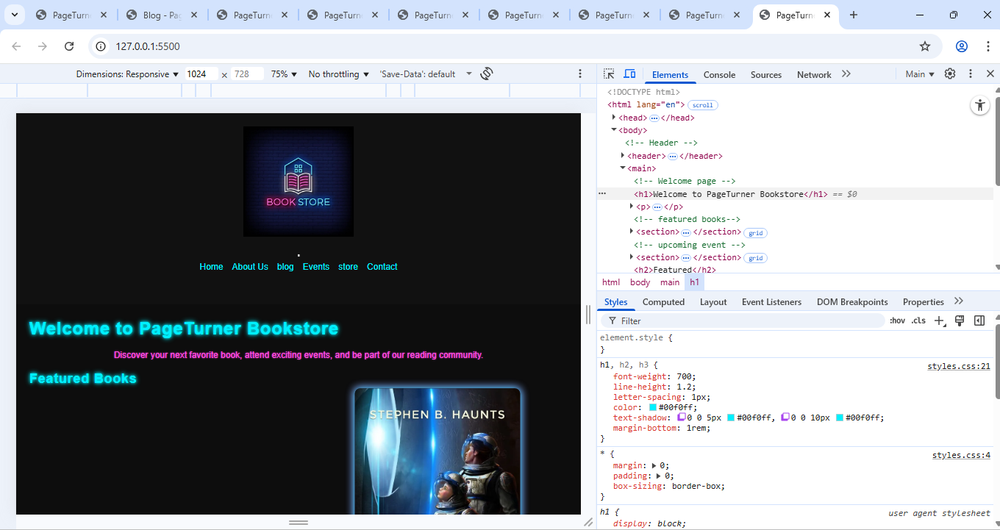
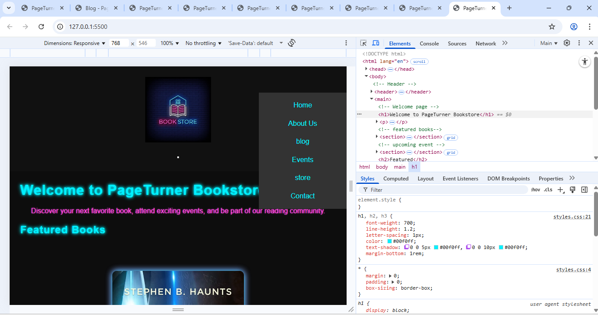
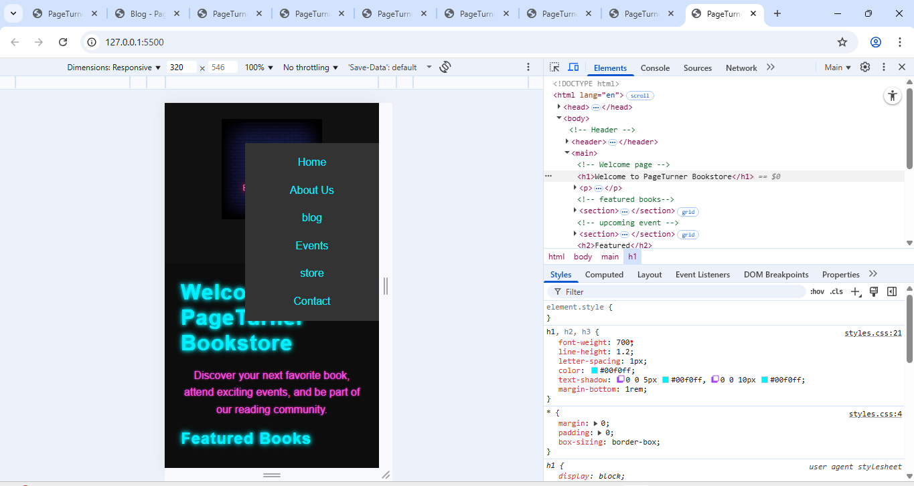

<--HOME PAGE-->
Online Bookstore Website

This is a fully responsive bookstore website built using HTML, CSS, and Visual studio code. It features a homepage, about us, blog,events, store and contact .

<--Overview-->

The Online Bookstore website allows users to:
- Browse a collection of books by category
- View book details (title, author, price, cover)
-Navigate through a responsive interface

<--Features-->

- Responsive homepage with featured books and upcoming events 
- Book detail page with description, pricing, and images
- Navigation bar and footer on all pages
- Mobile-friendly layout

PART 02
## Features added
- Responsive design for desktop and mobile devices
- Hamburger menu for mobile navigation
- Featured books section
- Upcoming events section
- Embedded video content
- Accessible navigation using ARIA attributes
- Footer with copyright information
## Navigation Screenshots





## Technologies Used
- HTML5 for page structure
- CSS3 for styling and responsive design
- JavaScript for hamburger menu toggle functionality


# How to Use
1.Clone or download the repository.
2.Open `index.html` in a web browser.
3 On mobile or narrow screens, click the hamburger button to reveal the navigation menu.

## References
- MDN Web Docs. (2025). *Using the <button> element*. [online] Available at: <https://developer.mozilla.org/en-US/docs/Web/HTML/Element/button> [Accessed 24 Sep. 2025].
- MDN Web Docs. (2025). *Media Queries*. [online] Available at: <https://developer.mozilla.org/en-US/docs/Web/CSS/Media_Queries> [Accessed 24 Sep. 2025].
- MDN Web Docs. (2025). *ClassList API*. [online] Available at: <https://developer.mozilla.org/en-US/docs/Web/API/Element/classList> [Accessed 24 Sep. 2025].
- MDN Web Docs. (2025). *ARIA: Accessible Rich Internet Applications*. [online] Available at: <https://developer.mozilla.org/en-US/docs/Web/Accessibility/ARIA> [Accessed 24 Sep. 2025].

part 03  POE
# PageTurner Bookstore Website  
A polished, responsive, and fully styled website for the fictional pageTurner Bookstore, featuring improved layout, navigation, media integration, and visual styling.


##  Project Overview  
This website represents a modern bookstore with pages for:
- Home  
- About Us  
- Blog  
- Events  
- Store  
- Contact Us  

The site includes improved readability, uniform design, and interactive elements.


## Improvements Made
This project was upgraded and cleaned up based on your earlier code. Below are the improvements:

###  1. Responsive Layout
- Flexible dimensions for images, text, and containers  
- Header layout adjusts for mobile and desktop  
- Navigation redesigned with spacing and alignment  

### 2.Professional CSS Styling
A complete CSS file was created including:
- Typography (font sizing & line heights)  
- Color scheme  
- Button styling  
- Card layouts  
- Hover effects  
- Media queries for smaller screens  

### Example features:
- Smooth hover transitions  
- Box shadows  
- Rounded borders  
- Clean whitespace and padding  


## Visual Enhancements
- Featured book and story sections redesigned  
- Article and section spacing improved  
- Images resized proportionally  
- Better visual hierarchy with font weights  


## 🎥 Media Integration
A fully functional **video player** was added on the homepage, using the `<video>` element with controls.


## Navigation Improvements
- Navigation links styled consistently  
- Better spacing for readability  
- Hover feedback added for interaction  


##  Folder Structure

project/
│
├── index.html
├── styles.css
├── README.md
│
├── assets/
│ ├── love.png
│ ├── science.webp
│ ├── book-store-neon-sign-with-brick-wall.jpg
│ └── WhatsApp Video 2025-08-26.mp4
│
└── pages/
├── about_us.html
├── Blog.html
├── event.html
├── store.html
└── contact_us.html

## Responsiveness
The CSS includes:
- `@media (max-width: 768px)` for mobile  
- Adjustments for stacking content  
- Fluid images and text resizing  


## Features You Can Expand Later
- JavaScript form validation  
- Dynamic gallery search bar  
- Animated hamburger menu  
- Google Map (interactive)  
- Tabs, accordion, and modal pop-ups  


##  technologies Used
- HTML5  
- CSS3  
- Media elements (Video, Images)  


## 📄 How to Use
1. Download the project folder  
2. Keep the **assets** and **pages** folders exactly as structured  
3. Open **index.html** in any browser  
4. Ensure **styles.css** is linked properly:  
   ```html
   <link rel="stylesheet" href="styles.css">


##  References

MDN Web Docs (2024) *HTML element reference*. Available at: https://developer.mozilla.org/en-US/docs/Web/HTML/Element (Accessed: 19 November 2025).

MDN Web Docs (2024) *CSS reference*. Available at: https://developer.mozilla.org/en-US/docs/Web/CSS/Reference (Accessed: 19 November 2025).

W3Schools (2024) *HTML Tutorial*. Available at: https://www.w3schools.com/html (Accessed: 19 November 2025).

W3Schools (2024) *CSS Tutorial*. Available at: https://www.w3schools.com/css (Accessed: 19 November 2025).

CSS-Tricks (2023) *A Complete Guide to Flexbox*. Available at: https://css-tricks.com/snippets/css/a-guide-to-flexbox/ (Accessed: 19 November 2025).

Google Fonts (2024) *Font Documentation*. Available at: https://fonts.google.com (Accessed: 19 November 2025).

MDN Web Docs (2024) *HTML5 video element*. Available at: https://developer.mozilla.org/en-US/docs/Web/HTML/Element/video (Accessed: 19 November 2025).

Stack Overflow (2024) *Developer Q&A Discussions*. Available at: https://stackoverflow.com (Accessed: 19 November 2025).


